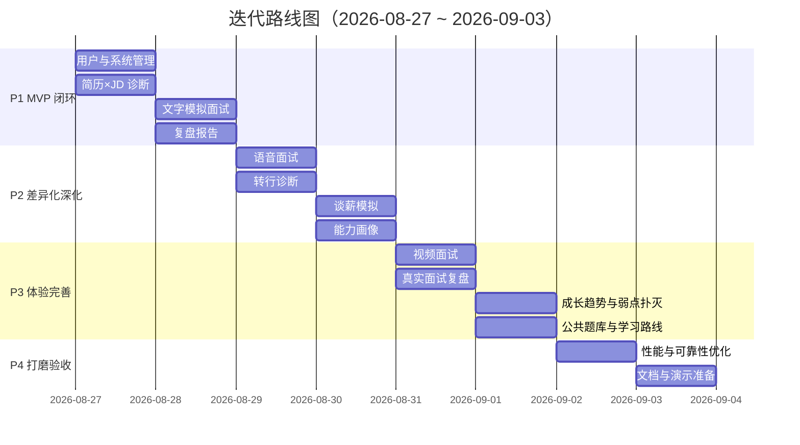

# AI 模拟面试官与职业规划系统 — 需求文档

| 项目名称 | AI 模拟面试官与职业规划系统 |
|---|---|
| 文档版本 | v1.2 |
| 创建日期 | 2026-08-27（v1.2 修订于 2026-08-31） |
| 文档类型 | 需求调研报告 / 需求文档（PRD） |
| 项目定位 | 课程 / 毕业设计项目 |
| 技术路线 | Python（FastAPI + LangChain + 向量检索） |

> **v1.2 修订说明**：在 v1.1 基础上补充已落地的真实面试复盘、备战计划、岗位数据同步与质量清洗、简历→岗位匹配、Offer 对比历史、岗位收藏与投递跟踪、题库批量导入与 AI 出题、能力画像与成长趋势等功能；同步更新用户故事、功能需求、接口约束、非功能需求、优先级和验收标准。

---

## 1. 项目概述

### 1.1 项目背景与动机

2025 年以来，AI 已深度渗透招聘领域，"AI 辅助求职"成为求职市场的新常态：

- **企业端 AI 面试已普及**：HireVue、ShowMeBug、牛客企业版等被大厂广泛用于候选人初筛，候选人需要在"对着镜头答题"的环节中通过机器评估；
- **求职者端训练工具存在断层**：市场上已有的模拟面试工具要么功能单一（只刷题、只练算法），要么面向企业端而非求职者，缺乏"从简历诊断到面试训练再到复盘提升"的一站式闭环；
- **求职者焦虑加剧**：校招海投无反馈、转行不知从何准备、跳槽谈薪没有底气——这些是求职全旅程中的真实痛点。

本项目面向**求职者（而非招聘方）**，利用大语言模型的语义理解、角色扮演与数据分析能力，构建一套"AI 模拟面试官 + 职业规划"系统：帮助用户诊断简历与目标岗位的差距、按需进行模拟面试训练、获得逐题批改与能力成长追踪，并提供转行诊断、谈薪模拟等差异化能力，最终形成"面试 → 评估 → 规划 → 学习"的求职全链路闭环。

### 1.2 项目目标

| 编号 | 目标 | 成功标准 |
|---|---|---|
| GOAL-01 | 构建可运行的 Web 模拟面试系统 | 支持文字 / 语音 / 视频三种面试形态的完整流程 |
| GOAL-02 | 实现"简历 × JD"智能匹配诊断 | 输入简历 + 岗位 JD 后 30 秒内产出匹配度评分与缺口清单 |
| GOAL-03 | 实现动态追问的面试 Agent | 面试官能基于候选人回答进行深度追问，而非机械出题 |
| GOAL-04 | 建立"面试→复盘→成长追踪"数据闭环 | 多场面试后可生成能力趋势报告与个性化学习建议 |
| GOAL-05 | 提供转行诊断与谈薪模拟差异化能力 | 具备独立可演示的功能模块与评分体系 |
| GOAL-06 | 形成规范的技术文档体系 | 需求、设计、实现文档齐备，满足课程/毕设评审要求 |
| GOAL-07 | 提供岗位广场与岗位导向的面试入口 | 从岗位卡片一键发起针对该岗位的模拟面试，岗位覆盖主要技术方向 |
| GOAL-08 | 面试可自定义面试官角色与难度 | 创建面试时可选择面试官（如 CTO 技术面/HR 综合面/压力面）与难度（简单/标准/困难） |
| GOAL-09 | 全站采用向导式分步交互与清爽视觉 | 所有功能页面遵循「步骤条 + 单卡片 + 底部导航」布局；导航极简化、侧边栏弱化 |

**产品级成功指标**（MVP 演示标准）：

| 指标 | 目标值 | 测量方式 |
|---|---|---|
| 简历×JD 诊断准确率 | ≥ 80% | 抽样人工核对缺口条目与真实差距的一致性 |
| 面试会话完成率 | ≥ 70% | 已开始面试中正常完成（非中途放弃）的比例 |
| 复盘报告生成成功率 | ≥ 95% | 面试结束后 60 秒内成功产出报告的比例 |
| 面试不中断率 | ≥ 99% | Agent/LLM 故障下走规则回退仍完成面试的比例 |

### 1.3 术语定义

| 术语 | 定义 |
|---|---|
| 知识原子（Knowledge Atom） | 题库中最小可发布的面试知识点单元，含题干、参考要点、标签、难度、状态（草稿/已发布/归档） |
| 动态 RAG | 结合候选人回答、岗位、面试阶段、历史已问知识点与召回结果，决策"下一问策略"的检索增强生成机制 |
| 追问信号 | 驱动面试官决策的四类信号：低信息回答、弱召回、连续回避、已用知识点排除 |
| 有边界 Agent | 面试官 Agent 单轮内只能调用受约束的只读工具（岗位知识检索/简历证据/学习覆盖），输出严格 JSON 契约，失败走规则回退 |
| 能力画像（Ability Profile） | 对用户多场面试表现聚合出的技能维度得分模型 |
| 可迁移技能 | 转行场景中，原岗位经验中可迁移到目标岗位的能力（如项目管理、沟通协作） |

---

## 2. 调研方法说明

> 结论先行：本项目需求来源于"桌面研究 + 竞品调研 + 用户访谈 + 问卷调查 + 文本分析"五种方法的交叉验证，确保每个痛点与功能优先级都有依据。

### 2.1 调研方法总览

| 方法 | 调研对象 | 数量/范围 | 方式 | 产出 |
|---|---|---|---|---|
| 桌面研究与数据分析 | 2024–2026 招聘市场报告、就业蓝皮书、招聘平台公开数据 | 报告 6 份 | 网络检索 + 数据摘录 | §1 背景依据、痛点佐证 |
| 竞品调研 | 牛客 AI 面试、Big Interview、Pramp、Interviewer.AI、Jobscan、智投简历、HireVue 等 | 8 款产品 | 官网文档、功能介绍、试用体验 | §5 竞品对比矩阵 |
| 半结构化访谈 | 校招生 / 转行者 / 在职跳槽者 | 5 人 | 线下 + 线上 1v1，每场 30–40 分钟 | §4 用户画像、User Story |
| 问卷调查 | 技术方向求职者 | 62 份有效问卷 | 问卷星 + 求职社群投放 | 功能优先级与用户占比（§4.1） |
| 文本分析 | 招聘平台后端 / 前端 / 算法岗位 JD | 30 份 | 关键词与任职要求统计 | 岗位技能高频项（FR-B-02 依据） |

### 2.2 关键调研结论

1. **痛点有共性**：访谈 5 人全部提到"面试后无反馈、不知道挂在哪"；62 份问卷中 87% 希望"面试后得到逐题批改"。
2. **工具断层被证实**：受访者均未使用过"简历诊断 → 模拟面试 → 复盘"一体化的求职者工具，现有工具要么只刷题、要么面向企业端。
3. **竞品空白清晰**：8 款竞品中无一款覆盖"转行诊断 + 谈薪模拟 + 能力追踪"的组合场景（详见 §5.2 对比矩阵）。
4. **优先级有数据支撑**：问卷中"简历×JD 差距诊断"（74%）与"模拟面试"（81%）需求度排名前两位，对应 MoSCoW 中的 M 级需求（§3.4）。

> 说明：访谈记录与问卷数据详见 §7.2、§7.3；以上为本课程项目示例数据，提交前请替换为真实调研记录。

---

## 3. 需求分析

### 3.1 用户需求分析

本项目围绕求职全旅程的四个核心场景展开。每个场景对应一组真实痛点：

| 场景 | 目标用户 | 核心痛点 | 解决方案 |
|---|---|---|---|
| **校招突围** | 应届生 | 海投无反馈、不知道与目标岗位差距、刷题无重点、面完不知死因 | 简历×JD匹配、倒计时备战日历、定向模拟面试、逐题复盘 |
| **转行诊断** | 转行者 | 不知可迁移什么、不知盲区在哪、面试被质疑转行动机 | 双岗位能力模型对比、转行专属面试模式、过渡项目推荐 |
| **跳槽谈薪** | 在职跳槽者 | 不知市场行情、谈薪心里没底、offer 不会对比 | 谈薪模拟器、薪资竞争力评估、offer 对比决策 |
| **真实面试复盘** | 所有求职者 | 面完真实公司不知道挂在哪、同类问题反复答不好 | 真实面试问答录入与逐句批改、能力成长趋势追踪 |

### 3.2 功能需求

功能需求按模块组织，编号规则 `FR-<模块>-<序号>`，优先级采用 MoSCoW 法（M=必须有，S=应该有，C=可以有，W=不需要/以后再说）。

#### 模块 A：用户与系统管理

| 编号 | 需求描述 | 优先级 |
|---|---|---|
| FR-A-01 | 用户注册、登录、登出，基于 JWT 的身份认证 | M |
| FR-A-02 | 用户资料管理（姓名、目标城市、工作年限、目标岗位方向） | M |
| FR-A-03 | 大模型 Provider 配置中心：支持 DeepSeek / Kimi / GLM / Qwen / 自定义 OpenAI 兼容接口，API Key 加密存储 | S |
| FR-A-04 | 系统级限流与请求日志，保障服务稳定性 | S |

#### 模块 B：简历 × JD 智能匹配

| 编号 | 需求描述 | 优先级 |
|---|---|---|
| FR-B-01 | 支持上传 PDF/文本简历并解析为结构化画像（技能、经历、项目、教育） | M |
| FR-B-02 | 支持粘贴目标岗位 JD，提取岗位技能要求与任职资格 | M |
| FR-B-03 | 简历与 JD 语义匹配评分，输出匹配度分数与结论 | M |
| FR-B-04 | 生成缺口清单：逐项列出"JD 要求但简历缺失/不足"的技能点 | M |
| FR-B-05 | 输出简历优化建议（针对每个缺口的改写方向） | S |
| FR-B-06 | 基于缺口自动生成"XX 天冲刺备战计划"（含每日学习内容） | S |

#### 模块 C：模拟面试

| 编号 | 需求描述 | 优先级 |
|---|---|---|
| FR-C-01 | 文字面试：浏览器内 SSE 流式对话，支持中途结束与主动追问 | M |
| FR-C-02 | 语音面试：基于 Web Speech API 的语音输入与播报输出 | S |
| FR-C-03 | 视频面试：摄像头采集 + 表情/情绪辅助分析（face-api.js） | C |
| FR-C-04 | 面试 Agent 具备"有边界"能力：单轮最多调用 3 个只读工具（岗位知识检索 / 简历证据 / 学习覆盖） | M |
| FR-C-05 | 动态追问：基于四类追问信号决策"深挖 / 补救 / 换知识点 / 项目追问" | M |
| FR-C-06 | 面试模式选择：常规模式、转行专属模式（质疑型面试官）、谈薪模式（HR 人设） | S |
| FR-C-07 | 面试按岗位 JD 定制：优先考察简历缺口与 JD 高频技能 | M |
| FR-C-08 | 面试过程中自动记录策略与证据（已问知识点、召回结果），不持久化思维链 | M |
| FR-C-09 | Agent/LLM 失败时走规则回退（模板问题 + 预设追问），保证面试不中断 | M |
| FR-C-10 | **面试官角色选择**：内置面试官角色库（如 CTO 技术面、资深架构师、HR 综合面、压力面、转行质疑面、谈薪 HR），不同角色注入差异化人设 Prompt 与提问风格 | S |
| FR-C-11 | **面试难度选择**：创建面试时可选 简单 / 标准 / 困难，Agent 按难度调整问题深度、追问强度与容错度；岗位默认难度可推荐 | M |

#### 模块 D：面试复盘与成长追踪

| 编号 | 需求描述 | 优先级 |
|---|---|---|
| FR-D-01 | 面试结束后生成复盘报告：总体评分、分维度得分（技术/表达/逻辑/项目） | M |
| FR-D-02 | 逐题批改：对用户每题回答给出评语与改进建议 | M |
| FR-D-03 | 真实面试复盘：用户手动录入真实面试问答，AI 逐句批改并对比标准考察点 | S |
| FR-D-04 | 能力画像生成：多场面试数据聚合为技能雷达图 | S |
| FR-D-05 | 成长趋势：时间维度上展示能力变化曲线，定位薄弱项 | S |
| FR-D-06 | 动态弱点扑灭：连续多次答不好的知识点自动推送学习材料与专项练习 | S |

#### 模块 E：转行诊断

| 编号 | 需求描述 | 优先级 |
|---|---|---|
| FR-E-01 | 输入"当前岗位 → 目标岗位"，生成双岗位能力模型对比 | S |
| FR-E-02 | 输出可迁移技能图谱与硬性缺口清单 | S |
| FR-E-03 | 转行专属面试模式：聚焦转行动机、可迁移经验与差距补救 | S |
| FR-E-04 | 过渡项目推荐：根据用户背景生成可快速上手的练手项目 idea | C |

#### 模块 F：跳槽谈薪

| 编号 | 需求描述 | 优先级 |
|---|---|---|
| FR-F-01 | 谈薪模拟器：HR/猎头人设角色扮演，训练应答话术 | S |
| FR-F-02 | 薪资竞争力评估：基于技能栈、工作年限、目标城市给出薪资区间参考 | S |
| FR-F-03 | offer 对比助手：输入多份 offer 结构（base+期权+福利），生成总包与长期收益分析 | C |
| FR-F-04 | Offer 对比历史：保存每次对比的 Offer 快照、评分表和 AI 建议，支持查看、删除与流式分析 | S |

#### 模块 G：题库与学习路线

| 编号 | 需求描述 | 优先级 |
|---|---|---|
| FR-G-01 | 题库管理：知识原子支持创建、编辑、发布、归档，状态流转清晰 | M |
| FR-G-02 | 仅"已发布"的知识原子可进入面试追问链路 | M |
| FR-G-03 | 公共题库 + 私有题库并存（普通用户私有，ADMIN 维护公共题库） | S |
| FR-G-04 | 知识覆盖统计：面试后展示已覆盖/未覆盖的知识点 | S |
| FR-G-05 | 学习路线推荐：基于能力缺口与面试覆盖情况生成个性化学习路径 | S |
| FR-G-06 | 题库批量导入：支持 JSON/Markdown 自动识别或显式格式导入，返回新增、跳过与错误明细 | S |
| FR-G-07 | AI 题目生成：按知识点和岗位生成题目，仅预览不自动入库，确认后保存为私有草稿 | S |

#### 模块 H：岗位广场与岗位导向面试

| 编号 | 需求描述 | 优先级 |
|---|---|---|
| FR-H-01 | 岗位广场首页：以卡片网格展示岗位（岗位名、方向、难度、技能标签、公司/来源），支持按方向与难度筛选 | M |
| FR-H-02 | 岗位数据源：内置系统预设岗位库（PUBLIC 岗位，由 ADMIN 维护）+ 用户自建岗位（PRIVATE）+ 预留外部招聘 API 同步位 | M |
| FR-H-03 | 从岗位卡片一键创建针对该岗位的模拟面试（岗位难度自动带入面试默认难度） | M |
| FR-H-04 | 岗位详情：展示岗位要求技能清单、参考 JD 文本、平均薪资区间（可选），可一键粘贴 JD 到简历诊断 | S |
| FR-H-05 | 岗位搜索结果：支持关键词搜索岗位（岗位名 / 方向 / 技能标签） | S |
| FR-H-06 | 我的岗位：展示用户收藏 / 自建岗位，支持一键进入备战（诊断 + 面试） | C |
| FR-H-07 | 岗位收藏与投递跟踪：支持收藏/取消收藏，并维护 saved/applied/interviewing/offer/rejected 状态与备注 | S |
| FR-H-08 | 岗位同步：支持手动触发、自动同步开关与同步间隔配置；外部数据失败不影响内置岗位 | S |

#### 模块 I：面试官与难度配置

| 编号 | 需求描述 | 优先级 |
|---|---|---|
| FR-I-01 | 内置面试官角色库：每个角色含角色名、人设描述、提问风格、适用的面试模式，界面以卡片形式选择 | S |
| FR-I-02 | 面试官角色与难度联动：创建面试时「选择面试官 → 选择难度」两步内完成，随面试模式（常规/转行/谈薪）自动推荐角色 | S |
| FR-I-03 | 面试过程中面试官角色以"人设"生效：Agent 的 system prompt 注入所选角色设定，动态追问策略按难度档位调节 | M |
| FR-I-04 | 难度档位行为差异：简单=基础概念 + 高容错引导；标准=常规深度 + 正常追问；困难=场景化深挖 + 低容错 + 组合知识点 | S |
| FR-I-05 | 面试记录留存所选面试官与难度，复盘报告中体现角色风格评语 | C |

#### 模块 J：UI/UX 交互规范（向导式 + 极简导航）

| 编号 | 需求描述 | 优先级 |
|---|---|---|
| FR-J-01 | 全站统一「向导式分步交互」：功能页面采用「顶部步骤条 + 单卡片内容区 + 底部导航按钮」，一屏聚焦一个任务 | M |
| FR-J-02 | 导航极简化：弱化侧边栏（窄栏 / 折叠 / 图标化），突出顶部品牌区与主内容留白 | M |
| FR-J-03 | 首页 Lollipop 风格：大标题 + 居中大输入框（"告诉我你想面试的岗位"）+ 岗位卡片网格 + 快捷功能入口 | S |
| FR-J-04 | 视觉基线：大留白、大圆角卡片、柔和渐变点缀、克制配色；步骤切换带 300ms 过渡动效 | S |
| FR-J-05 | 响应式适配：桌面优先，移动端侧边栏自动收起为抽屉 | S |

#### 核心输入/输出数据规格（MVP）

| 模块 | 输入 | 输出（字段级） |
|---|---|---|
| 简历×JD 匹配（FR-B-03/04/05） | 简历结构化画像 + JD 文本 | `{ match_score: 0-100, gaps: [{ skill, required_level, current_level, suggestion }], resume_suggestions: [...] }` |
| 面试消息（FR-C-01） | 用户回答文本（≤ 2000 字） | `{ role, content, strategy: 深挖/补救/换题/项目追问, evidence_atom_ids: [] }` |
| 创建面试（FR-C-10/11） | 岗位 + 简历 + 面试官 + 难度 + 模式 | `{ position_id, resume_id, interviewer_id, difficulty: easy/normal/hard, interview_type }` |
| 复盘报告（FR-D-01/02） | 整场面试消息流 + 画像 | `{ overall_score: 0-100, dimensions: { tech, expression, logic, project }, question_feedback: [{ question, user_answer, score, comment, suggestion }] }` |
| 转行诊断（FR-E-01/02） | 当前岗位 + 目标岗位 | `{ transferable: [{ skill, evidence }], gaps: [{ skill, level }], career_path: [...] }` |
| 谈薪评估（FR-F-02） | 技能栈 + 年限 + 城市 + 目标岗位 | `{ salary_range: [min, mid, max], factors: [...], strategy: [...] }` |
| 简历→岗位匹配 | 简历 + 方向/城市/难度筛选 + limit | `{ items: [{ position, match_score, matched_skills, missing_skills, reason, dimension_breakdown }] }` |
| 真实面试复盘（FR-D-03） | 公司/岗位/轮次 + 问答列表 | `{ items: [{ question, answer, score, comment }], review: { overall_score, dimensions, summary, suggestions } }` |
| 备战计划（FR-B-06/FR-G-05） | 目标岗位 + 天数 + 可选简历/岗位 | `{ tasks: [{ day, title, description, topics, done }], status }` |
| Offer 对比（FR-F-03/04） | ≥2 个 Offer + 可选权重 | `{ table: [...], analysis, record_id }` |

### 3.3 非功能需求

| 类别 | 编号 | 需求描述 |
|---|---|---|
| 性能 | NFR-01 | SSE 流式响应首 token 延迟 < 2s（网络正常时） |
| 性能 | NFR-02 | 简历解析 + 匹配诊断全流程 < 30s |
| 性能 | NFR-03 | 支持 ≥ 50 并发面试会话（演示规模） |
| 安全 | NFR-04 | 用户 API Key 加密存储（AES），不明文入库 |
| 安全 | NFR-05 | 所有接口需 JWT 鉴权，面试上下文仅本人可访问 |
| 可靠 | NFR-06 | LLM/向量库不可用时系统降级可用，面试主流程不中断 |
| 可靠 | NFR-07 | 向量库视为可重建索引，业务真相以关系数据库为准 |
| 可扩展 | NFR-08 | 岗位方向可配置化（MVP 技术岗，预留产品/运营等扩展） |
| 可扩展 | NFR-09 | LLM Provider 可插拔，支持多供应商切换 |
| 可用性 | NFR-10 | 中文界面，响应式布局，兼容主流浏览器 |
| 可用性 | NFR-10a | 全站功能页面遵循向导式分步交互（步骤条 + 单卡片 + 底部导航），一屏一任务 |
| 可用性 | NFR-10b | 导航极简化、侧边栏弱化，核心内容区留白充足 |
| 可维护 | NFR-11 | 代码分层清晰、接口有 OpenAPI 文档、关键模块有单元测试 |
| 可扩展 | NFR-12 | 面试官角色库与难度档位可配置化（DB 或配置文件驱动，新增角色/难度不改代码） |
| 安全 | NFR-13 | 用户私有数据（简历、面试、报告、Offer、计划、岗位跟踪）必须按当前用户隔离查询、修改和删除 |
| 可靠 | NFR-14 | 岗位同步按数据源标识幂等 upsert；单一数据源失败时保留已有岗位与内置兜底数据 |
| 可用性 | NFR-15 | 报告生成提供状态查询、失败提示和重新生成入口；Offer 分析不可用时仍展示规则评分表 |

#### 边界情况与数据校验（MVP）

| 场景 | 处理策略 |
|---|---|
| 简历文件非法（非 PDF/文本、超过 10MB、解析失败） | 返回明确错误提示；允许用户改为手动粘贴简历文本 |
| JD 为空或过短（< 50 字） | 提示补充；用户确认后使用内置岗位模板 |
| 简历文本 > 50KB / JD > 20KB | 前端截断 + 提示，后端二次校验 |
| 面试中途断线 / 页面刷新 | 会话持久化，支持恢复继续 |
| LLM 超时 / 返回非法 JSON | 走规则回退（FR-C-09），面试不中断 |
| 用户 API Key 失效或额度超限 | 明确报错并引导重新配置 Provider |
| 语音输入识别失败 | 提示后回退为文字输入 |
| 摄像头权限被拒绝 | 视频面试降级为语音/文字模式 |
| 连续 3 轮用户回答为空 | 视为放弃本轮，面试官给出总结并结束 |
| 岗位同步重复触发 | 返回同步进行中状态；同一数据源按 source + source_id 幂等更新，不产生重复岗位 |
| AI 题目生成失败或格式错误 | 返回可重试错误；不创建半成品题目，成功结果须用户确认后保存为私有草稿 |
| Offer 少于 2 个或 AI 分析失败 | 提示至少录入 2 个；规则评分表仍可用，分析字段显示降级状态 |

### 3.4 需求优先级矩阵（MoSCoW）

| 优先级 | 需求范围 | 对应阶段 |
|---|---|---|
| **M（必须有）** | 模块 A（登录/Provider 配置）、模块 B 全部、模块 C 文字面试核心链路（FR-C-01/04/05/07/08/09）、**FR-C-11 难度选择**、模块 D 复盘（FR-D-01/02）、模块 G 题库核心（FR-G-01/02）、**模块 H 岗位广场（FR-H-01/02/03）**、**模块 J 向导式与极简导航（FR-J-01/02）** | Phase 1 MVP |
| **S（应该有）** | 语音面试、视频面试、备战日历、真实面试复盘、能力画像/成长追踪、转行诊断、谈薪模拟、公共题库、知识覆盖、**面试官角色库（FR-C-10、FR-I-01~04）**、**岗位搜索与详情（FR-H-04/05）**、**首页 Lollipop 风格（FR-J-03/04）** | Phase 2–3 |
| **C（可以有）** | 过渡项目推荐、情绪分析深化、**我的岗位（FR-H-06）**、**面试官评语复盘（FR-I-05）** | Phase 4 |
| **已落地扩展** | 简历→岗位匹配、真实面试复盘、备战计划、岗位收藏/投递跟踪、岗位同步、题库导入/AI 出题、Offer 对比历史 | 当前版本 |
| **W（暂不需要）** | 多租户、移动端 App、支付计费、外部招聘平台实时爬取 | 后续迭代 |

---

## 4. 用户画像分析

### 4.1 目标用户群

本项目面向三类核心用户（次要用户为在职提升者），均以**中文互联网技术求职者**为主：

| 用户群 | 占比预估 | 核心诉求 |
|---|---|---|
| 校招生（应届/准应届） | 45% | 快速了解目标岗位、突击准备、提升面试通过率 |
| 转行者 | 30% | 明确能力差距、获得转行可行性判断、准备转行面试 |
| 在职跳槽者 | 20% | 谈薪博弈、offer 决策、高阶岗位面试准备 |
| 其他（在职提升） | 5% | 长期能力成长、知识盲区探测 |

### 4.2 用户画像卡

#### 画像 1：校招生 — "焦虑的小林"

| 维度 | 描述 |
|---|---|
| 基本信息 | 22 岁，某双非院校计算机专业大四，秋招季 |
| 背景 | 有 1 段小厂实习，无大厂经验，投了 80 份简历只收到 3 个面试 |
| 痛点 | 不知道简历为什么被筛掉；背了八股文但面试官一问项目就卡壳；面完大厂无反馈，不知道自己死在哪一轮 |
| 行为 | 刷牛客面经、背 LeetCode、关注各类"押题"资源；时间紧，需要"精准复习"而非海量刷题 |
| 期望 | 想知道自己与目标岗位差在哪、优先补什么、用最像真实面试的方式反复练 |
| 关键场景 | 上传简历 + 粘贴某大厂后端 JD → 看到"缺口：分布式缓存经验"→ 按备战日历练 3 天 → 模拟面试被追问到缺口知识点 → 复盘定位弱点 |

#### 画像 2：转行者 — "迷茫的老张"

| 维度 | 描述 |
|---|---|
| 基本信息 | 28 岁，运维工程师 4 年，想转后端开发 |
| 背景 | 会用 Linux/Shell/Docker，写过少量 Python 脚本，对 Java/分布式系统不熟 |
| 痛点 | 不知道运维经验哪些能写进简历、哪些是必须补的盲区；担心面试官问"你没有开发经验凭什么胜任" |
| 行为 | 在各类社区看转行攻略，信息零散，缺乏系统性诊断 |
| 期望 | 一张清晰的"可迁移技能 vs 硬性缺口"清单；一场专门针对转行质疑的模拟面试 |
| 关键场景 | 输入"运维→后端开发"→ 得到能力对比图（可迁移：部署/排查/容器化；缺口：Java/微服务/算法）→ 用"质疑型面试官"模拟面试训练应答 → 得到过渡项目 idea |

#### 画像 3：跳槽者 — "犹豫的 Lisa"

| 维度 | 描述 |
|---|---|
| 基本信息 | 30 岁，前端工程师 5 年，想跳槽涨薪 30% |
| 背景 | 技术扎实，但 5 年没经历过正经面试，对市场行情完全没概念 |
| 痛点 | 被问"期望薪资"时心里没底；拿到 offer 不敢谈，怕谈崩；两三个 offer 之间不会算总包 |
| 行为 | 偷偷看招聘软件，刷别人的薪资分享，不敢找同事聊 |
| 期望 | 有数据支撑的薪资区间；像真人 HR 一样的谈薪演练；理性的 offer 对比 |
| 关键场景 | 谈薪模拟器演练"您的期望薪资是多少"→ AI 反馈话术问题 → 输入技能/年限/城市得到薪资区间 → 录入 2 份 offer 对比总包与成长性 |

### 4.3 用户场景故事（User Story）

| 编号 | 用户 | 故事 | 关联需求 |
|---|---|---|---|
| US-01 | 小林 | 作为校招生，我想上传简历并粘贴目标 JD，以便知道我与岗位的差距 | FR-B-01~06 |
| US-02 | 小林 | 作为校招生，我想让面试官针对我的简历缺口提问，以便我重点补弱 | FR-C-07 |
| US-03 | 小林 | 作为求职者，我想在面试后看到逐题批改和弱点清单，以便有针对性地改进 | FR-D-01/02 |
| US-04 | 老张 | 作为转行者，我想看到当前岗位与目标岗位的能力对比，以便知道该补什么 | FR-E-01/02 |
| US-05 | 老张 | 作为转行者，我想接受"质疑型"模拟面试，以便从容应对真实转行面试 | FR-E-03 |
| US-06 | Lisa | 作为跳槽者，我想用 HR 人设模拟谈薪，以便练习报价与话术 | FR-F-01 |
| US-07 | Lisa | 作为求职者，我想看到我的能力成长曲线，以便判断准备是否到位 | FR-D-05 |
| US-08 | 所有 | 作为用户，我想在面试被打断/系统出错时面试仍能继续，以便流程可靠 | FR-C-09 |

### 4.4 用户旅程图

以校招生"小林"为例的核心旅程：

```
发现 → 注册 → 简历诊断 → 定向备战 → 模拟面试 → 复盘 → 成长追踪 → 再面试
 │       │        │           │          │         │        │
见学长  选后端  上传简历  根据缺口    文字/语音  逐题批改  多场聚合
转发    绑定Provider 粘贴JD    生成日历    面试官动态追问  弱点清单  能力曲线
                            └──────── 情绪峰值：看到"缺口清单"与"逐题批改" ────────┘
                            └──── 流失风险点：注册门槛高（要配 API Key）、首次诊断耗时长 ────┘
```

**关键体验要求**：
1. 首次使用可提供"游客体验"（内置演示 Key 或免费额度），降低注册门槛；
2. 简历诊断结果需"可解释"——分数之外必须给出具体的缺口条目与改写建议；
3. 面试复盘反馈必须是"针对用户真实回答"的批改，而非模板话术。

---

## 5. 竞品分析

> **直接竞品**：牛客 AI 面试、Big Interview、Pramp、Interviewer.AI、AI Interview Coach、Mockmate——求职者端 AI 面试训练工具，功能高度重合；
> **间接竞品**：Jobscan、智投简历、超级简历（仅简历匹配、不含面试训练）、HireVue、ShowMeBug、赛码（企业端 AI 面试/测评，面向招聘方而非求职者）——以不同形式满足同一求职需求。

### 5.1 竞品全景

按服务对象与核心功能分为三类：

| 类别 | 代表产品 | 服务对象 | 核心能力 |
|---|---|---|---|
| 求职者端 AI 面试训练 | 牛客 AI 模拟面试、Big Interview、Pramp、Interviewer.AI、AI Interview Coach、Mockmate | 求职者 | 模拟面试问答、行业题库、视频/文本表现分析 |
| 简历匹配与优化 | Jobscan、智投简历、TalenCat 天才猫、超级简历 WonderCV、AI 简历 | 求职者 | 简历×JD 关键词匹配、简历优化、基础职业方向建议 |
| 企业端 AI 面试/测评 | HireVue、ShowMeBug、赛码、用友大易、myInterview | 招聘方 | 大规模初筛、编程能力测评、AI 面试官评估 |

### 5.2 竞品功能对比矩阵

以"求职者端"关键功能为维度，对比代表性产品与本项目：

| 功能维度 | 牛客AI面试 | Big Interview | Pramp | Interviewer.AI | Jobscan/智投简历 | **本项目** |
|---|:---:|:---:|:---:|:---:|:---:|:---:|
| 简历×JD 匹配诊断 | 部分 | ✗ | ✗ | ✗ | ✓ | ✓（含缺口清单） |
| 模拟面试（文字） | ✓ | ✓ | ✓ | ✓ | ✗ | ✓（SSE 流式） |
| 模拟面试（语音/视频） | 部分 | ✓ | ✓ | ✓ | ✗ | ✓ |
| 动态追问（基于回答） | 部分 | ✗ | 部分 | ✗ | ✗ | ✓（四信号决策） |
| 逐题批改复盘 | 部分 | ✓ | 部分 | ✓ | ✗ | ✓（真实回答批改） |
| 能力画像与成长追踪 | ✗ | 部分 | ✗ | ✗ | ✗ | ✓ |
| 转行能力诊断 | ✗ | ✗ | ✗ | ✗ | ✗ | ✓（差异化） |
| 谈薪模拟 | ✗ | 部分 | ✗ | ✗ | ✗ | ✓（差异化） |
| 真实面试复盘 | 部分 | ✗ | ✗ | ✗ | ✗ | ✓ |
| 多 Provider 可配置 | ✗ | ✗ | ✗ | ✗ | ✗ | ✓ |
| 求职全链路闭环 | ✗ | 部分 | ✗ | ✗ | 部分 | ✓ |

> 注：✓=支持；✗=不支持；部分=有限支持。数据基于 2025–2026 年公开资料整理。

### 5.3 差异化定位分析

| 竞品优势（可借鉴） | 竞品空白（我们的机会） |
|---|---|
| 牛客题库量大、校招场景深耕 | 没有"简历×JD 缺口驱动面试"，题库与个人差距不联动 |
| Big Interview 面试维度分析全面 | 偏欧美市场，中文支持弱；无转行/谈薪场景 |
| Jobscan 关键词匹配成熟 | 只给匹配度，不给"怎么练"的后续动作，无面试训练 |
| HireVue 等企业端产品验证了"AI 面试官"可行性 | 求职者端缺少个人化、可配置、可长期追踪的训练工具 |
| — | 无竞品覆盖"诊断→备战→面试→复盘→谈薪→追踪"全旅程 |

**定位结论**：本项目不做"题库最大的平台"，而是做**"最懂你的求职 AI 伙伴"**——以简历×JD 缺口为锚点，以动态追问面试为核心，以职业规划为延伸，形成差异化闭环。

### 5.4 创新点总结

1. **缺口驱动的定向面试**：模拟面试问题由"简历与 JD 的差距 + 高频技能"动态生成，而非随机抽题；
2. **有边界的动态追问 Agent**：面试官决策基于四类追问信号，且受工具约束、输出契约、失败回退三重保障，贴近真实面试官的追问逻辑；
3. **求职全链路数据闭环**：面试表现转化为能力画像，进而驱动备战日历与学习路线，形成"训练即成长"的飞轮；
4. **转行诊断与谈薪模拟**：切入竞品普遍空白的细分场景，用大模型角色扮演实现高价值交互；
5. **用户自配大模型**：不绑定单一供应商，用户自带 Key 即可使用，降低项目运营成本。

---

## 6. 需求落地建议与迭代路线图

> 结论先行：开发按 MoSCoW 的 M 级需求优先、S/C 逐阶段推进，4 个迭代阶段在 2026-08-27 ~ 09-03 的提交窗口内完成，保证每个阶段结束都有可演示的完整闭环。

### 6.1 落地原则

1. **闭环优先**：每一阶段都交付"入口 → 主流程 → 结果反馈"的完整闭环（如 P1 交付"简历诊断 → 模拟面试 → 复盘"），避免只完成半截功能；
2. **M 先 S 后**：严格按 §3.4 优先级矩阵排期，M 级未验收不进入 S 级开发；
3. **可演示**：每个阶段结束产出可演示版本与验收清单（对齐 §8 M 级验收标准）。

### 6.2 迭代路线图（2026-08-27 ～ 2026-09-03）

| 阶段 | 时间窗口 | 里程碑 | 交付范围 |
|---|---|---|---|
| **P1 · MVP 闭环** | 2026-08-27 ~ 08-28 | 注册登录 + 简历×JD 诊断 + 文字模拟面试 + 复盘报告跑通；全站向导式骨架 + 极简导航上线 | 模块 A/B 全部、C 文字链路（FR-C-01/04/05/07/08/09/11）、D（FR-D-01/02）、G（FR-G-01/02）、H（FR-H-01/02/03）、J（FR-J-01/02） |
| **P2 · 差异化深化** | 2026-08-29 ~ 08-30 | 语音面试、转行诊断、谈薪模拟、能力画像可用；面试官角色库与难度联动上线 | FR-C-02/06/10、FR-D-04、模块 E、F（FR-F-01/02）、H（FR-H-04/05）、I（FR-I-01~04）、J（FR-J-03/04） |
| **P3 · 体验完善** | 2026-08-31 ~ 09-01 | 视频面试、真实面试复盘、成长趋势、公共题库、岗位详情 | FR-C-03、FR-D-03/05/06、FR-G-03/04/05、FR-B-06、FR-H-06、FR-I-05 |
| **P4 · 打磨验收** | 2026-09-02 ~ 09-03 | 性能优化、文档齐备、演示准备 | 全部验收标准、OpenAPI 文档、单元测试、演示录屏 |

### 6.3 里程碑甘特图



### 6.4 里程碑验收要点

| 里程碑 | 验收要点 |
|---|---|
| P1 | 新用户 10 分钟内可完成"注册 → 上传简历/粘贴 JD → 开始模拟面试 → 拿到复盘报告"全流程 |
| P2 | 转行诊断与谈薪模拟可独立演示；语音面试在 Chrome 上可跑通 |
| P3 | 多场面试后可看到能力趋势曲线；视频面试可降级不中断 |
| P4 | 全部 §8 验收标准勾选通过，交付演示视频与部署说明 |

---

## 7. 附录

### 7.1 附录 A：需求跟踪矩阵

| 需求编号 | 所属模块 | 优先级 | 关联用户故事 | 对应功能描述 |
|---|---|---|---|---|
| FR-A-01 | 用户与系统管理 | M | US-08 | JWT 认证 |
| FR-A-02 | 用户与系统管理 | M | — | 用户资料管理 |
| FR-A-03 | 用户与系统管理 | S | US-08 | Provider 配置中心 |
| FR-A-04 | 用户与系统管理 | S | — | 限流与日志 |
| FR-B-01 | 简历×JD 匹配 | M | US-01 | 简历解析 |
| FR-B-02 | 简历×JD 匹配 | M | US-01 | JD 解析 |
| FR-B-03 | 简历×JD 匹配 | M | US-01 | 匹配评分 |
| FR-B-04 | 简历×JD 匹配 | M | US-01 | 缺口清单 |
| FR-B-05 | 简历×JD 匹配 | S | US-01 | 简历优化建议 |
| FR-B-06 | 简历×JD 匹配 | S | US-02 | 备战日历 |
| FR-C-01 | 模拟面试 | M | US-03 | 文字面试 |
| FR-C-02 | 模拟面试 | S | US-03 | 语音面试 |
| FR-C-03 | 模拟面试 | C | US-03 | 视频面试 |
| FR-C-04 | 模拟面试 | M | US-02 | 有边界 Agent |
| FR-C-05 | 模拟面试 | M | US-02 | 动态追问 |
| FR-C-06 | 模拟面试 | S | US-05/06 | 面试模式 |
| FR-C-07 | 模拟面试 | M | US-02 | JD 定制提问 |
| FR-C-08 | 模拟面试 | M | — | 策略记录 |
| FR-C-09 | 模拟面试 | M | US-08 | 失败回退 |
| FR-D-01 | 复盘与追踪 | M | US-03 | 复盘报告 |
| FR-D-02 | 复盘与追踪 | M | US-03 | 逐题批改 |
| FR-D-03 | 复盘与追踪 | S | US-07 | 真实面试复盘 |
| FR-D-04 | 复盘与追踪 | S | US-07 | 能力画像 |
| FR-D-05 | 复盘与追踪 | S | US-07 | 成长趋势 |
| FR-D-06 | 复盘与追踪 | S | — | 弱点扑灭 |
| FR-E-01 | 转行诊断 | S | US-04 | 能力模型对比 |
| FR-E-02 | 转行诊断 | S | US-04 | 可迁移技能/缺口 |
| FR-E-03 | 转行诊断 | S | US-05 | 转行面试模式 |
| FR-E-04 | 转行诊断 | C | US-04 | 过渡项目推荐 |
| FR-F-01 | 跳槽谈薪 | S | US-06 | 谈薪模拟器 |
| FR-F-02 | 跳槽谈薪 | S | US-06 | 薪资评估 |
| FR-F-03 | 跳槽谈薪 | C | — | offer 对比 |
| FR-F-04 | 跳槽谈薪 | S | — | Offer 对比历史与流式分析 |
| FR-G-01 | 题库与学习 | M | — | 题库管理 |
| FR-G-02 | 题库与学习 | M | — | 发布状态约束 |
| FR-G-03 | 题库与学习 | S | — | 公共/私有题库 |
| FR-G-04 | 题库与学习 | S | — | 知识覆盖统计 |
| FR-G-05 | 题库与学习 | S | US-02 | 学习路线推荐 |
| FR-G-06 | 题库与学习 | S | — | 题库批量导入 |
| FR-G-07 | 题库与学习 | S | — | AI 题目生成与草稿保存 |
| FR-C-10 | 模拟面试 | S | US-05/06 | 面试官角色选择 |
| FR-C-11 | 模拟面试 | M | US-02 | 面试难度选择 |
| FR-H-01 | 岗位广场 | M | US-01 | 岗位卡片网格与筛选 |
| FR-H-02 | 岗位广场 | M | — | 岗位数据源（内置+自建+预留同步） |
| FR-H-03 | 岗位广场 | M | US-02 | 岗位一键发起面试 |
| FR-H-04 | 岗位广场 | S | US-01 | 岗位详情与 JD 带入 |
| FR-H-05 | 岗位广场 | S | — | 岗位关键词搜索 |
| FR-H-06 | 岗位广场 | C | — | 我的岗位收藏/自建 |
| FR-H-07 | 岗位广场 | S | — | 岗位收藏与投递跟踪 |
| FR-H-08 | 岗位广场 | S | — | 岗位同步与自动同步配置 |
| FR-I-01 | 面试官配置 | S | US-05/06 | 面试官角色库 |
| FR-I-02 | 面试官配置 | S | — | 角色与难度联动 |
| FR-I-03 | 面试官配置 | M | US-02 | 角色人设生效 |
| FR-I-04 | 面试官配置 | S | — | 难度档位行为差异 |
| FR-I-05 | 面试官配置 | C | — | 角色评语复盘 |
| FR-J-01 | UI/UX | M | — | 向导式分步交互 |
| FR-J-02 | UI/UX | M | — | 极简导航/弱化侧边栏 |
| FR-J-03 | UI/UX | S | — | 首页 Lollipop 风格 |
| FR-J-04 | UI/UX | S | — | 视觉基线（留白/圆角/动效） |
| FR-J-05 | UI/UX | S | — | 响应式适配 |

### 7.2 附录 B：用户访谈记录摘录

> 半结构化访谈，5 人，每场 30–40 分钟。以下为 3 份代表性记录摘录（示例，请替换为真实记录）。

| 编号 | 受访者背景 | 关键对话摘录 | 需求启示 |
|---|---|---|---|
| I-01 | 校招生，计算机大四，投了 80 份简历收到 3 个面试 | "面完某大厂没任何反馈，我根本不知道挂在哪一轮，只能继续海投。" | 复盘与逐题批改（FR-D-01/02） |
| I-01 | 同上 | "刷了两个月八股文，但面试官一问项目细节就崩，感觉白刷。" | 项目追问与缺口定向面试（FR-C-05/07） |
| I-02 | 运维 4 年，想转后端开发 | "运维经验哪些能写进简历、哪些是必须补的，没人告诉我。" | 转行能力对比与可迁移技能（FR-E-01/02） |
| I-02 | 同上 | "最怕被问'你凭什么胜任开发'，根本不知道怎么答。" | 转行专属面试模式（FR-E-03） |
| I-03 | 前端 5 年，计划跳槽 | "被问期望薪资时心里完全没底，也不敢找同事打听行情。" | 谈薪模拟与薪资评估（FR-F-01/02） |

### 7.3 附录 C：问卷统计摘要

> 通过问卷星 + 求职社群投放，回收有效问卷 62 份（示例数据，请替换）。受访者：应届生 45%、转行者 30%、在职跳槽者 20%、其他 5%。

| 题项 | 结果 | 对应需求 |
|---|---|---|
| 你是否知道简历为何被筛掉？ | 61% 完全不知道 | FR-B-04 缺口清单 |
| 是否希望面试后得到逐题批改？ | 87% 希望 | FR-D-02 |
| 你更想要哪种训练方式？ | 81% 模拟面试；74% 简历×JD 差距诊断 | 模块 B / C 优先级 |
| 是否使用过一体化求职训练工具？ | 92% 没有 | 全链路闭环定位 |
| 对 AI 模拟面试的接受度？ | 77% 愿意使用 | 项目可行性 |

---

## 8. M 级需求验收标准（MVP）

> 以下为 M 优先级（19 条）需求的开发验收标准，可勾选。

**模块 A：用户与系统管理**

- [ ] A-01：注册后可用账号登录；未登录访问业务接口返回 401
- [ ] A-02：资料编辑后重新登录仍生效

**模块 B：简历 × JD 智能匹配**

- [ ] B-01：上传 ≤10MB PDF/文本简历，30 秒内完成解析并展示结构化画像
- [ ] B-02：粘贴 JD 后正确提取技能与任职要求（人工抽验 ≥ 5 条命中）
- [ ] B-03：输出 0-100 匹配分，且对同一简历+JD 结果稳定可复现
- [ ] B-04：缺口清单逐项包含 `skill / required_level / current_level / suggestion` 四要素
- [ ] B-05：每个缺口给出可执行的简历改写方向

**模块 C：模拟面试**

- [ ] C-01：文字面试支持 SSE 流式输出；支持用户主动结束与暂停恢复
- [ ] C-04：单轮工具调用 ≤ 3 次且仅限岗位知识/简历证据/学习覆盖
- [ ] C-05：至少识别并响应两类追问信号（低信息回答 / 已用知识点排除）
- [ ] C-07：首问与追问优先覆盖简历缺口与 JD 高频技能
- [ ] C-08：会话记录包含策略字段，且不含思维链内容
- [ ] C-09：模拟 LLM 故障时面试可正常完成（规则回退）

**模块 D：面试复盘与成长追踪**

- [ ] D-01：面试结束后 60 秒内产出复盘报告（总体分 + 四维度分）
- [ ] D-02：每题反馈包含评语与改进建议，且引用用户真实回答

**模块 G：题库与学习路线**

- [ ] G-01：知识原子可创建/编辑/发布/归档，状态流转有权限校验
- [ ] G-02：草稿/归档状态的知识原子不会出现在面试追问中

**模块 H：岗位广场与岗位导向面试**

- [ ] H-01：岗位广场以卡片网格展示岗位，可按方向与难度筛选
- [ ] H-02：内置岗位库包含 ≥ 10 个覆盖主要技术方向的公开岗位
- [ ] H-03：从岗位卡片点击「开始面试」可直接创建该岗位的模拟面试，岗位难度自动带入
- [ ] H-04：岗位详情展示技能清单与参考 JD，可一键带入简历诊断

**模块 C 扩展 / 模块 I：面试官与难度**

- [ ] C-10/I-01：面试官角色库 ≥ 4 个角色（CTO 技术面 / HR 综合面 / 压力面 / 转行质疑面），卡片化选择
- [ ] C-11/I-03：创建面试时选择难度生效，不同难度首问与追问深度可感知差异
- [ ] I-04：简单档问题以基础概念为主、标准档正常深度、困难档含组合知识点深挖
- [ ] I-05：面试记录留存所选面试官与难度，复盘报告中可体现角色风格评语

**模块 J：UI/UX 交互规范**

- [ ] J-01：至少 4 个功能页面（简历诊断 / Offer 对比 / 面试设置 / 复盘）为「顶部步骤条 + 单卡片 + 底部导航」结构
- [ ] J-02：侧边栏弱化为窄栏/折叠，主内容区留白充足；首页包含居中大输入框 + 岗位卡片网格

---

*（文档结束）*
